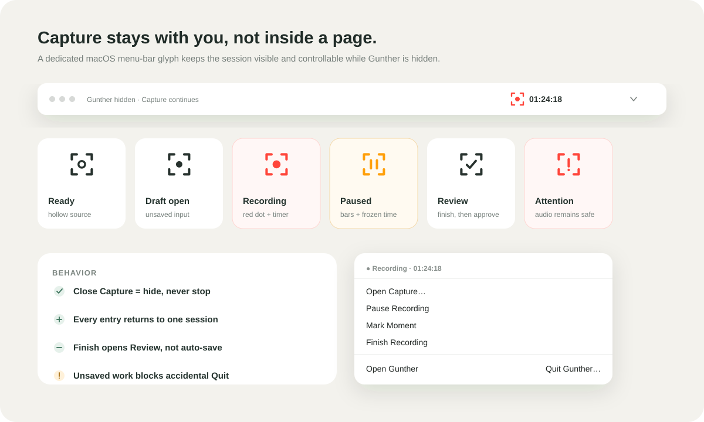

# Gunther Capture 独立窗口与 macOS 菜单栏设计（v2）

## 1. 产品原则

**Capture 是独立的采集工具，Library 是内容的长期归宿。**

1. **打开即可书写。** Capture 出现时光标已经在笔记里；文档、网页、照片、录音、表格都只差一次按键（⌘1–6），不需要先在卡片菜单里选择类型。
2. **菜单栏图标是 Gunther 的身份，而不是录音按钮。** 空闲时只显示品牌标记“G”；只有真正在采集时它才改变，并且结束后立刻恢复平静。
3. **形状与文字表达状态，颜色只作强调。** 红色只属于正在录音，琥珀色只属于暂停；每个状态在去掉颜色后依然能靠形状和菜单文字区分。
4. **单例。** Gunther 只维护一个 Capture 实例。已有录音、导入或未保存内容时，任何入口都只把它显示出来，不会覆盖或并行创建第二个。

文档、网页、图片、笔记、表格和录音都是平级的来源。录音在菜单栏多一组控制动作，是因为它有持续时间和后台状态，并不代表它高于其他采集方式。

## 2. 入口与快捷键

| 入口 | 快捷键 | 行为 |
|---|---|---|
| 标题栏 `Capture`、菜单栏 `Capture…`、File ▸ Capture… | ⌘⇧C | 打开 Capture，笔记就绪 |
| File ▸ New Recording、菜单栏 `New Recording` | ⌘⇧R | 直接进入录音 |
| File ▸ New Note | ⌘N | 新建笔记并在它的详情页中书写（Ask 中为新会话） |
| 知识库内 `Add` / `Record` | — | 同一个 Capture，预选当前知识库为归档目标 |
| Capture 内切换类型 | ⌘1–6 | Note · Web page · Document · Photo · Recording · Table |
| Capture 内保存 | ⌘↵ | 保存当前内容 |
| Capture 内隐藏 | Esc | 隐藏到菜单栏；内容与录音都不丢失 |
| 搜索 | ⌘K 或 / | 显示主窗口并进入搜索 |
| 设置 | ⌘, | Gunther ▸ Settings… |
| 全部快捷键 | ⌘/ 或 ? | 快捷键一览（与匹配逻辑来自同一份注册表） |

在桌面应用中，⌘N、⌘⇧C、⌘⇧R、⌘K、⌘,、⌘/、⌘⇧L 由原生菜单负责（菜单中可见，在 Capture 窗口中同样有效）；网页层只在浏览器开发模式下处理它们，因此同一次按键永远只触发一次。单字母快捷键在输入框中自动暂停；Esc 总是先关闭最上层（菜单 → 灯箱 → 对话框 → 页面返回）。

## 3. Capture 窗口

```
┌──────────────────────────────────────────────────────────────┐
│ ●●●   G Capture │ Saved to Inbox until you choose a home  ⌕ ⤡ │
│ [✎ Note] 🌐 Web page  ▤ Document  ◉ Photo  🎙 Recording  ▦ Table │
├──────────────────────────────────────────────────────────────┤
│ Title (optional)                                             │
│ Write the thought as it comes. Markdown works…               │
│                                                              │
├──────────────────────────────────────────────────────────────┤
│ Save to [▣ Inbox ⌃⌄]                    🗑 Discard [✓ Save ⌘↵] │
└──────────────────────────────────────────────────────────────┘
```

- **标题区**：品牌标记 + 一行状态（例如“Saved to Inbox until you choose a home”、录音时“Recording · 12:48”并带红点）；右侧是搜索与“Hide to menu bar”。整条标题区可拖动窗口，左侧为交通灯留出空间。
- **类型栏**：六个类型按钮，图标在悬停和选中时显示身份色（笔记 clay、网页 amber、文档 blue、照片 violet、录音 rose、表格 green）；选中项为白底细边的浮起标签。它是标准的 tablist，←/→ 可在类型间移动。
- **底栏**：`Save to` 使用与详情页相同的知识库选择器（首项为 Inbox），有未保存内容时出现 `Discard`，主按钮随类型变化（Save note / Save web page / Save document / Save photo / Save recording / Save table）并显示 ⌘↵。

各类型：

- **Note**：大号书写区，支持 Markdown。粘贴单个链接或多行表格数据时，下方出现提示“Save as web page / Save as table”，由用户决定是否切换。
- **Web page**：URL 输入框，合法时即时显示域名标签；说明“Gunther 会保存这页不可变的快照”；可选的“Why you’re saving it”。
- **Document / Photo**：大号拖放区或选择文件；选中后显示文件卡片（照片为缩略图），可替换或移除。整个窗口任何位置都能拖入文件，自动切换到对应类型。
- **Recording**：Lecture / Meeting / Memo 分段选择；录音卡片包含计时、电平（空闲为中性灰、录音为 rose、暂停为 amber）、开始/导入、保存与转写状态；实时转写可编辑；可恢复的草稿与中断会话列在上方。
- **Table**：等宽输入区，实时检测“9 rows · 5 columns detected”。

切换类型会保留已输入的标题与正文；只有会丢失已选文件、或进入录音会替换文本时才需要确认。`Discard` 是释放单例的明确动作。

## 4. 两套互不干扰的状态

采集状态：

`Ready → Requesting → Recording ⇄ Paused → Finalizing → Review ready → Saving → Saved`

显示状态：

`Visible ⇄ Minimized ⇄ Hidden`

移动、最小化、隐藏或关闭主窗口都不能改变采集状态。只有 `Finish Recording` 可以结束录制；只有用户确认保存后，内容才进入 Inbox 或指定 Library。

## 5. 菜单栏图标

菜单栏使用 Gunther 自己的标记：单笔画的“G”，横笔末端是一个知识节点。安静的状态是 macOS Template Image，由系统自动适配浅色和深色菜单栏；只有正在采集时才离开模板，让标记退为灰色，把节点变成状态灯。



| 状态 | 图标 | 标题文字 | 模板图像 |
|---|---|---|---|
| Ready | “G”与实心节点 | 无 | 是 |
| Unsaved capture | “G” + 开口处圆点徽标 | 无 | 是 |
| Review ready | 同上（菜单文字区分） | 无 | 是 |
| Preparing / Saving | 节点变为空心 | 无 | 是 |
| Recording | 灰色“G” + 红色录音灯 | 经过时间，如 `12:48` | 否 |
| Paused | 灰色“G” + 琥珀色双竖线 | 暂停时间，如 `12:48` | 否 |
| Needs attention | 灰色“G” + 红色徽标 | 无 | 否 |

实现要点：

- 图标在 `src-tauri/src/tray_glyph.rs` 中以 36 px（18 pt @2x）程序化绘制，4×4 超采样抗锯齿，不依赖图片文件；旧版 20 px 的取景框图标在 Retina 上发虚，且空闲态本身就像录音按钮。
- **标题必须用空字符串清除。** tray-icon 在 macOS 上把 `set_title(None)` 当作“不修改”，旧版因此在录音结束后仍残留计时，看起来一直在录音。
- 图标只在状态变化时重绘；菜单只在动作集合变化时重建；录音时每秒只更新状态行和计时。
- 设置 ▸ 外观 ▸ 菜单栏：**Always show** / **Only while capturing**。后者在空闲时隐藏菜单栏项，录音、未保存内容或需要注意时自动出现。偏好保存在应用配置目录的 `menu-bar.json`，启动时先读取，因此不会闪现。

## 6. 菜单动作（随状态变化）

菜单只显示此刻可做的事，不再把灰掉的 Pause / Mark / Finish 一直挂在空闲菜单里。

| 状态 | 菜单 |
|---|---|
| Ready | Capture… · New Recording · — · Search Gunther… · Open Gunther · — · Quit Gunther |
| Recording / Paused | `Recording · 12:48 — 标题`（状态行） · — · Pause Recording / Resume Recording · Mark Moment · Finish Recording… · — · Show Recorder · Open Gunther · — · Quit Gunther… |
| Preparing / Saving | 状态行 · — · Show Capture · Open Gunther · — · Quit Gunther… |
| Review ready | 状态行 · — · Review Recording… · Open Gunther · — · Quit Gunther… |
| Unsaved capture | 状态行 · — · Continue Capture… · Open Gunther · — · Quit Gunther… |
| Needs attention | 状态行 · — · Show Capture… · Open Gunther · — · Quit Gunther |

单击菜单栏图标直接打开菜单。`Finish Recording…` 只进入 Review，不会把未经确认的内容写入知识库；菜单中不提供高风险的 `Discard`。退出受保护时，Quit 显示为 `Quit Gunther…`。

## 7. 应用菜单（macOS）

- **Gunther**：About · Settings… ⌘, · Services · Hide / Hide Others / Show All · Quit Gunther ⌘Q
- **File**：New Note ⌘N · Capture… ⌘⇧C · New Recording ⌘⇧R · Search… ⌘K · Close Window ⌘W
- **Edit**：Undo · Redo · Cut · Copy · Paste · Select All
- **View**：Keyboard Shortcuts ⌘/ · Switch Light and Dark ⌘⇧L · Enter Full Screen
- **Window** / **Help**：Minimize · Zoom · Keyboard Shortcuts

Quit 必须是自定义菜单项（见 README）：系统的 `PredefinedMenuItem::quit` 会绕过可取消的退出检查。

## 8. 关闭与退出

- 关闭或 Esc 空闲的 Capture：隐藏窗口。
- 关闭或 Esc 正在录音的 Capture：隐藏窗口，录音继续，菜单栏显示计时。
- 关闭主窗口：隐藏主窗口，菜单栏继续运行。
- 录音、请求权限、导入、存在未完成 Review，或 Note/Link/File 等采集已有未保存输入时选择退出：阻止退出并显示 Capture，提示用户先保存、完成或保留草稿。
- 用户完成并保存后，可再次选择 `Quit Gunther` 正常退出。

非录音内容也参与同一条 singleton 保护：一旦标题、正文、网址或文件发生变化，新的 Capture 入口只能显示现有窗口，不能重置表单。只有保存、明确 `Discard`，或将录音转为可恢复草稿后，状态才回到 Ready。

## 9. 失败与安全

- SenseVoice 暂时断线：音频继续保存，转写显示重连状态。
- 后端暂时不可用：录音分片和草稿保存在本机，恢复连接后重试。
- 麦克风或系统睡眠中断：保留已写入的音频，标记为 interrupted，允许下次恢复。
- 保存失败：保持内容和本地重试副本，不静默关闭窗口。
- 首次麦克风权限必须由用户本人确认；拒绝后应允许导入已有音频。

## 10. 平台边界

当前录音仍由 Tauri WebView 内的浏览器音频栈持有。macOS 14 及以上可关闭隐藏 WebView 的后台节流，适合本版的独立窗口与菜单栏后台体验；macOS 11–13 虽仍可运行 Gunther，但不能把隐藏窗口下持续数小时的稳定性表述为已经保证。若要对这些系统提供同等级的长时录音承诺，后续需把音频采集迁移到原生进程，并让 WebView 只负责显示和控制。

## 11. 核心验收场景

1. 按 ⌘⇧C 打开 Capture，直接输入并按 ⌘↵ 保存；内容出现在 Inbox。
2. 在 Capture 中粘贴一个链接，接受“Save as web page”，保存后在 Inbox 中看到网页快照。
3. 把 PDF 拖到 Capture 任意位置，自动切换为 Document 并显示文件卡片。
4. 开始录音：菜单栏图标变为灰色“G”+ 红灯并显示计时；菜单出现 Pause / Mark / Finish。
5. Esc 隐藏 Capture、关闭主窗口，确认录音、计时、音频落盘和转写仍继续。
6. 从菜单栏暂停（琥珀双竖线）、继续、标记并结束录音，进入 Review（开口处徽标，计时消失）。
7. 保存后菜单栏回到安静的“G”，没有残留计时，菜单只剩 Capture / New Recording / Search / Open / Quit。
8. 活动录音时尝试退出，确认应用阻止退出且没有丢失会话。
9. 设置“Only while capturing”后空闲时菜单栏项消失，开始录音时自动出现；重启后偏好保持。
10. 重新启动后，确认未保存草稿或 interrupted 录音仍可恢复。
