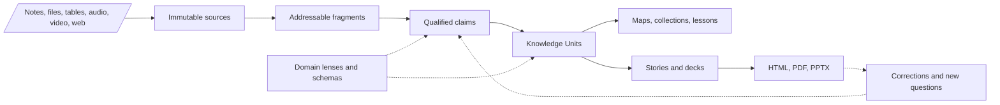
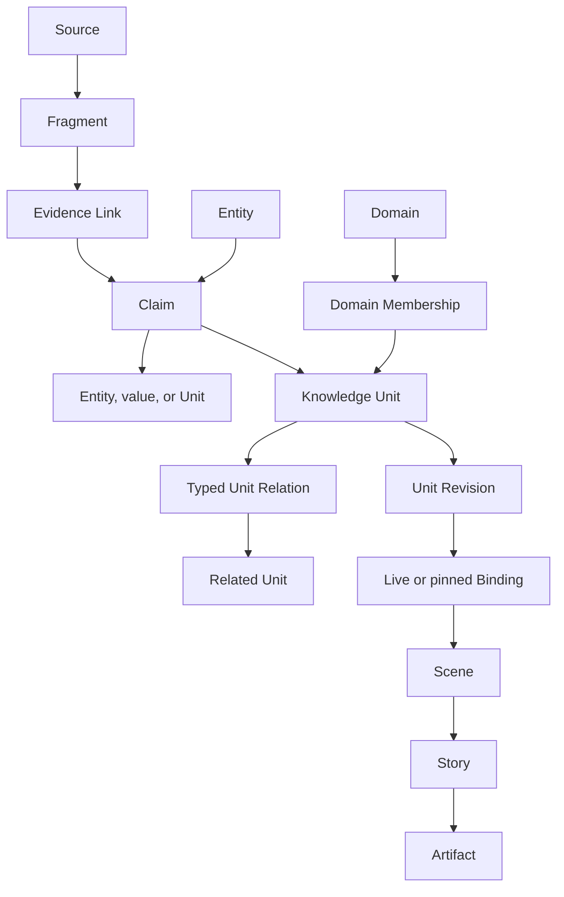
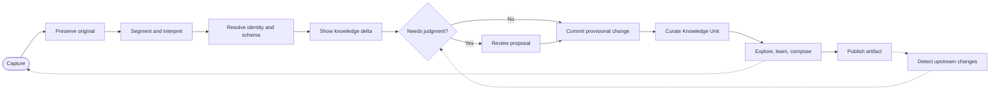
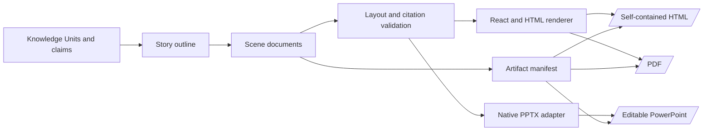
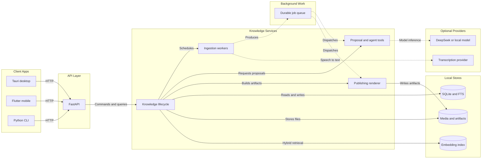

# Gunther product blueprint

Status: proposed product foundation  
Version: 2.0  
Reviewed: 2026-08-26  
Research: [PRODUCT_RESEARCH.md](./PRODUCT_RESEARCH.md)

## 1. Product definition

Gunther is a **living, evidence-backed knowledge studio**. It turns what a person reads, watches, records, writes, or imports into small maintainable knowledge units, then lets those units be explored, reviewed, taught, and composed into pages, maps, HTML stories, and slide decks.

It is not primarily:

- a folder of documents;
- a chat interface over embeddings;
- a graph of note links;
- a presentation generator that forgets its sources.

Its core promise is:

> Capture once. Understand and correct over time. Reuse everywhere without losing the evidence.

## 2. The missing concept: Knowledge Unit

The existing `Source → Fragment → Entity → Assertion → Evidence` model is a strong truth layer, but it lacks a human-facing unit of understanding.

### Definition

A **Knowledge Unit** is the smallest independently understandable, addressable, revisable, and reusable explanation in Gunther.

A unit may explain a concept, definition, fact, method, procedure, theorem, formula, model, example, observation, or open question. It contains a structured body for humans and references the atomic claims and evidence that justify it.

Examples:

- `CD3D as a T-cell marker` — concept explanation plus scoped marker claims and evidence.
- `Chain rule` — definition, formula, intuition, examples, prerequisites, and proof references.
- `SWOT analysis` — management method, steps, conditions, examples, and limitations.

### What is—and is not—the base unit

| Object | Purpose | Durable? |
| --- | --- | --- |
| Source | Preserves the imported material | Yes, immutable versions |
| Fragment | Gives an exact quote, row, cell, page, or timestamp | Yes |
| Claim | Stores one qualified proposition and its evidence | Yes |
| **Knowledge Unit** | Stores one curated, reusable piece of understanding | **Yes; primary user-facing unit** |
| Card | Displays a unit or fragment in the interface | No; it is a view |
| Canvas | Arranges units spatially | Yes as layout, not as truth |
| Slide/page | Communicates units to an audience | Yes as an artifact, not as truth |

The claim is the smallest machine-reasonable unit. The Knowledge Unit is the smallest human-usable unit. Gunther needs both.

## 3. Product model at a glance



The graph is the relationship structure across claims and units. Search and embeddings are indexes over these objects, never their replacement.

## 4. One library, many domains

Biology, mathematics, and management should not become isolated projects or separate databases. Gunther has one personal library and uses **Domains** as lenses.

A unit can belong to zero, one, or several domains. A cross-domain unit such as `network effects in biological and commercial ecosystems` should not be duplicated.

Each Domain can install a **Domain Pack** containing:

- entity types;
- claim predicates;
- common qualifiers;
- validation rules;
- unit templates;
- extraction examples;
- recommended views and renderers.

| Domain | Example entity types | Example predicates | Important qualifiers |
| --- | --- | --- | --- |
| Biology | Gene, Protein, CellType, Tissue, Species | `marker_of`, `expressed_in`, `regulates` | species, tissue, assay, condition |
| Mathematics | Concept, Theorem, Formula, Variable, Proof | `depends_on`, `implies`, `generalizes` | assumptions, domain, notation |
| Management | Framework, Goal, Metric, Role, Decision | `measures`, `responsible_for`, `constrains` | organization, period, scenario |

Domain Packs guide the system; they do not own the data. Users can accept, edit, or ignore proposed schema changes.

## 5. Durable data model

### Existing objects to keep

- `Source`
- `Fragment`
- `Entity`
- `Assertion` as the internal name for a product-facing Claim
- `EvidenceLink`
- `Revision`

### Objects to add

- `Domain` and `DomainMembership`
- `KnowledgeUnit` and immutable `UnitRevision`
- `UnitClaim` and typed `UnitRelation`
- `Collection` for manual or query-backed lists
- `Canvas`, `CanvasNode`, and `CanvasEdge` for spatial views
- `Story`, `Scene`, and `Binding` for publishing
- `Artifact` for compiled HTML/PDF/PPTX builds
- `Proposal` and `ReviewTask` for LLM changes
- `Job` for transcription, extraction, rendering, and reprocessing

### Relationship model



### Claim requirements

A claim must support:

- subject, predicate, and an entity, unit, or typed literal object;
- qualifiers such as species, tissue, method, assumptions, and validity time;
- multiple supporting, refuting, or mentioning evidence links;
- status: `provisional`, `trusted`, `disputed`, or `deprecated`;
- separate freshness: `current`, `stale`, or `unknown`;
- supersession and contradiction links;
- actor, model, prompt/tool version, time, and reason for every mutation.

Confidence must not appear as a mysterious single truth score. The interface should expose its components: extraction certainty, evidence strength, source agreement, human review, and freshness.

### Knowledge Unit shape

```json
{
  "id": "unit_chain_rule",
  "title": "Chain rule",
  "kind": "concept",
  "domains": ["mathematics"],
  "body": { "type": "doc", "content": [] },
  "claimRefs": ["claim_derivative_composition"],
  "relations": [
    { "predicate": "depends_on", "target": "unit_function_composition" }
  ],
  "status": "trusted",
  "headRevisionId": "urev_42"
}
```

The body is a schema-constrained JSON document, not stored HTML. Initial block types:

- paragraph, heading, list, quote, callout;
- code, equation, table, image, audio, video;
- citation and evidence excerpt;
- claim block and Knowledge Unit embed;
- graph query, dataset view, and diagram.

## 6. Knowledge lifecycle



### The knowledge delta

Every import must say what it did:

- **New** — a new entity, claim, or unit was proposed.
- **Reinforced** — additional evidence supports an existing claim.
- **Narrowed** — a qualifier limits a previously broad claim.
- **Contradicted** — evidence or a claim disagrees with trusted knowledge.
- **Superseded** — a newer claim replaces an older one for a stated scope.
- **Unresolved** — identity, schema, or evidence is ambiguous.

This is more useful than “27 chunks indexed.”

### Maturity and review

Knowledge moves through explicit states:

1. `Captured` — source exists; no interpretation is assumed.
2. `Provisional` — an LLM or rule proposed structure.
3. `Trusted` — a person or trusted rule accepted it.
4. `Disputed` — conflicting claims remain visible.
5. `Deprecated` — retained for history but not used by default.

Review tasks are created for conflicts, duplicate identity, weak evidence, schema violations, stale trusted units, and artifact drift. Review should be a diff with accept, edit, split, merge, dispute, and reject actions.

## 7. Entry, editing, embedding, and import

### Entry points

- global quick capture for a thought, quote, or question;
- paste or type into a structured editor;
- drag files or folders;
- URL and browser capture;
- audio/video recording or upload;
- table/CSV and single-cell annotation import;
- API and Python CLI for batch or agent workflows.

The lightweight **Notebook** is the deliberate exception to source-first ingestion. A quick note remains an editable, searchable local draft with no required domain or Knowledge Base and triggers no extraction. Only the explicit **File into knowledge** action preserves a read-only Source snapshot and sends its candidate claims through review. Direct **Add knowledge** entry points still create a Source first so imported material is never interpreted without preserving the original.

### Editing rules

- Editing a unit creates a new `UnitRevision`.
- Editing a trusted claim creates a proposal or a superseding claim; it never silently overwrites history.
- A user can edit prose without accepting every generated claim.
- Claim and evidence blocks open their exact source location.
- Embedding a unit never copies its canonical content unless the user chooses “detach.”

### Import behavior by medium

| Input | Preserved source | Fragment address |
| --- | --- | --- |
| Note or document | original text/file plus hash | block, paragraph, page |
| Web page | URL, capture time, readable snapshot | heading and text range |
| PDF or paper | original file | page and bounding box |
| Table or dataset | original file and schema | sheet, row, column, cell |
| Audio or video | media file plus transcript | timestamp range and speaker |
| PowerPoint | original PPTX plus slide image | slide, shape, speaker note |

Arbitrary PowerPoint round-trip editing is not an MVP promise. Imported slides are evidence sources; Gunther-native scenes are editable publishing objects.

## 8. Interface architecture

Gunther has no project switcher. The top level is one living library.

### Primary navigation

1. **Home** — capture, recent learning, knowledge delta, and continue work.
2. **Library** — Knowledge Units, entities, domains, collections, and sources.
3. **Map** — focused graph, paths, comparisons, and canvases.
4. **Studio** — write units, lessons, pages, stories, and decks.
5. **Review** — conflicts, proposals, duplicates, stale units, and artifact drift.

Settings and profile remain utility destinations. `Add knowledge` remains global.

### Knowledge base and session workspace

A Knowledge Base is a durable field of accepted and growing knowledge. It owns many **Sessions**, each representing one line of inquiry. Opening a base defaults to its session workspace:

- **left pane** — searchable session history with new, pin, rename, and archive actions;
- **center pane** — the conversation, chapter focus, visible source scope, and composer;
- **right pane** — the selected answer's immutable retrieval snapshot, claim citations, and source-scope controls.

A session stores its title, base, chapter focus, chosen sources, messages, timestamps, and archive/pin state. Each assistant message stores its own citations and retrieval metrics so later changes to the library do not rewrite history. Selecting a source subset affects future turns only; earlier answers remain inspectable against the scope that produced them.

Knowledge Base identity and boundaries are durable backend objects. Creating a base asks for its guiding question and scope, then opens a minimal Overview chapter and first session. Curated chapter bodies can still ship as bundled field packs, but they are projections over the durable base rather than the base's identity.

Session branches preserve the parent session and exact message where the fork occurred. Narrow layouts replace the persistent history pane with a modal session drawer instead of removing access to history. Long-running responses expose a stop-waiting control that restores the draft; future streaming transport should propagate cancellation to the model provider as well.

The session is a working surface, not the canonical knowledge layer. Promoting an answer into the knowledge base creates a reviewable proposal. Archiving hides a session without deleting its history.

### Domains are lenses, not workspaces

The active Domain is a filter chip or saved lens in Library, Map, and Studio. Switching from Biology to Mathematics changes suggestions and visible content without moving the user into another project.

### Knowledge Unit screen

The central editor shows the human explanation. A stable inspector shows:

- type, domains, aliases, and status;
- claims and their qualifiers;
- source evidence and exact locations;
- related and embedded units;
- backlinks and artifact usage;
- revision history and pending proposals.

AI actions live beside the object they affect: `extract claims`, `find conflicts`, `suggest structure`, `explain`, `create examples`, or `compose into story`. A generic chat remains available for exploration but is not the primary editing model.

### Map modes

Do not default to every node. Provide purposeful views:

- neighborhood around one unit;
- shortest reasoning path between two units;
- prerequisite map;
- evidence and contradiction map;
- domain overview;
- change over time;
- manually arranged canvas backed by a query.

## 9. HTML and slide publishing

Knowledge and presentation must remain separate. A slide is a projection of knowledge for an audience, not the canonical knowledge itself.

### Publishing objects

- **Story** — purpose, audience, ordered narrative, selected units, and outline.
- **Scene** — one page/slide/canvas with layout, components, notes, and theme tokens.
- **Binding** — connects a scene element to a unit, claim, query, or fixed value.
- **Artifact** — a reproducible build with format, manifest, renderer version, and source revision IDs.

Binding modes:

- `live` — follows the unit head and displays upstream changes before rebuild;
- `pinned` — always uses a chosen revision for reproducibility;
- `detached` — copies content into a local scene override.

### Save the UI, not a screenshot

A Scene stores:

- a normalized 16:9 or page coordinate system;
- responsive constraints or grid positions;
- semantic component types;
- content bindings;
- theme token references;
- component and renderer versions;
- optional animation and speaker notes.

Thumbnails are caches. The source of truth is inspectable scene JSON.

### Rendering pipeline



HTML is the richest output and may include interactive graphs, evidence popovers, and responsive layouts. PDF uses the same renderer in print mode.

PPTX export maps supported components to native text, shape, table, chart, image, and speaker-note objects. Unsupported interactive components fall back to SVG or high-resolution images and are listed in the export report. This is more reliable than trying to convert arbitrary HTML/CSS into editable PowerPoint.

### Editing generated slides

- Editing bound content offers `edit Knowledge Unit` or `make local override`.
- Updating a unit creates an `upstream changes` badge on affected scenes.
- Refresh shows a visual and semantic diff before changing the scene.
- A useful slide correction can be promoted back into the Knowledge Unit as a proposal.
- Each exported slide can include hidden provenance metadata and visible citations when the theme requires them.

## 10. LLM and future agent design

LLMs interpret and propose; deterministic services validate and commit.

### LLM responsibilities

- segment and classify source material;
- extract entities, claims, qualifiers, and exact evidence spans;
- resolve aliases and propose merges;
- detect reinforcement, contradiction, and staleness;
- synthesize or revise Knowledge Units;
- suggest domains and Domain Pack changes;
- answer through a selected subgraph with citations;
- compose stories, scenes, quizzes, and review prompts;
- critique an artifact for unsupported statements, overflow, and audience mismatch.

### Safe write protocol

Every model write follows one protocol:

1. read an explicit scope;
2. return a typed proposal;
3. validate schema, references, permissions, and evidence spans;
4. show the semantic diff and expected effects;
5. commit an event only after policy or user approval;
6. retain model, prompt/tool version, inputs, and reason.

Agents never receive raw database write access. They call Python tools such as:

- `ingest_source`
- `propose_claims`
- `resolve_entities`
- `propose_unit_patch`
- `find_conflicts`
- `compose_story`
- `render_artifact`
- `verify_artifact`

DeepSeek remains the default optional provider. The provider adapter must allow local or other remote models without changing domain behavior.

## 11. System architecture



### Storage decisions

- Start with SQLite, normalized relational tables, JSON only for flexible typed payloads, and FTS5.
- Store original files, media, thumbnails, and compiled artifacts outside the database with content hashes.
- Keep embeddings rebuildable and disposable.
- Add PostgreSQL and object storage only when multi-user collaboration or scale requires them.
- Do not adopt a graph database until measured traversal workloads justify it.

### Proposed Python boundaries

```text
apps/backend/gunther/
  api/                 HTTP routes and wire schemas
  domain/              entities, claims, units, domains, policies
  ingestion/           parsers, segmentation, transcription, jobs
  knowledge/           identity, deltas, review, search, graph queries
  agents/              provider adapters and typed proposal tools
  publishing/          stories, scenes, HTML/PDF/PPTX renderers
  infrastructure/      database, files, queues, model providers
```

Desktop owns the full Studio. Mobile initially owns quick capture, reading, lightweight editing, and review. Both use the same API and never access SQLite directly.

## 12. Migration from the current repository

The current implementation should evolve, not restart.

1. Keep current sources, fragments, entities, evidence links, and revisions.
2. Make an Assertion independent of one `source_id`; evidence links already allow several sources to support one claim.
3. Allow claim objects to be entities, typed values, or Knowledge Units.
4. Strengthen entity identity beyond normalized label plus type; record aliases, external IDs, merge history, and domain context.
5. Add qualifier schema and explicit contradiction/supersession links.
6. Add Knowledge Units and unit revisions before building a richer graph UI.
7. Replace overview counts as the product center with the knowledge delta and “continue learning” actions.
8. Add Story/Scene only after units can be edited and cited reliably.

## 13. Delivery plan and gates

### Phase 1 — Knowledge foundation

- migrations for Domains, multi-evidence Claims, Knowledge Units, and proposals;
- structured unit API and editor;
- knowledge delta and focused review;
- global search across units, claims, fragments, and sources.

**Gate:** import two conflicting sources, preserve both, update one unit through a reviewable diff, and trace every sentence back to evidence.

### Phase 2 — Domain workflows

- Biology, Mathematics, and Management starter Domain Packs;
- single-cell table ingestion;
- recording/transcript ingestion;
- focused graph views and query-backed collections.

**Gate:** the same core objects support the single-cell and online-course examples without domain-specific tables in the knowledge core.

### Phase 3 — Studio and HTML publishing

- Story outline and Scene editor;
- unit/claim/query bindings;
- themes and reusable scene components;
- self-contained HTML and PDF rendering;
- artifact manifests and upstream-change detection.

**Gate:** build a cited five-slide story from trusted units, revise one unit, and show exactly which scenes are affected.

### Phase 4 — Editable PowerPoint

- native PPTX component mapping;
- citations, notes, charts, tables, equations, and fallback reporting;
- visual regression tests against HTML/PDF/PPTX renders.

**Gate:** exported text, shapes, tables, and charts remain editable in PowerPoint, while every fallback is disclosed.

### Phase 5 — Agents and collaboration

- resumable agent workflows and budgets;
- source monitoring and stale-knowledge proposals;
- permissions, sync, comments, ownership, and shared review.

**Gate:** no agent can silently mutate trusted knowledge or publish unsupported claims.

## 14. Product success criteria

Gunther is successful when a user can:

1. capture a note, table, paper, recording, webpage, or PPTX without organizing first;
2. see exactly what knowledge was added, reinforced, narrowed, contradicted, or left unresolved;
3. maintain a cited Knowledge Unit across repeated imports without losing history;
4. browse Biology, Mathematics, and Management as lenses in one library;
5. edit, embed, relate, and reuse a unit without copying it;
6. ask a question and inspect the claims, graph path, and source fragments behind the answer;
7. compose units into an HTML story or editable PowerPoint deck;
8. revise knowledge and see which published artifacts became stale;
9. export the library and artifacts in documented, machine-readable formats;
10. let an LLM do substantial work while retaining review, provenance, undo, and model independence.

## 15. Explicit non-goals for the first releases

- a universal ontology for every discipline;
- pixel-perfect import and round-trip editing of arbitrary PowerPoint files;
- autonomous truth determination;
- a public knowledge marketplace;
- real-time multi-user editing before the single-user lifecycle is reliable;
- a graph database chosen for appearance rather than measured need;
- a global graph as the primary navigation system.

## Final product decision

Gunther's foundational abstraction is:

> **Evidence-backed claims are curated into versioned Knowledge Units; Knowledge Units are composed through live or pinned bindings into maps, lessons, pages, and presentation Scenes.**

That sentence should guide schema, API, interface, agents, and export decisions. If a feature cannot preserve this chain, it should remain an import/export adapter rather than enter the knowledge core.
