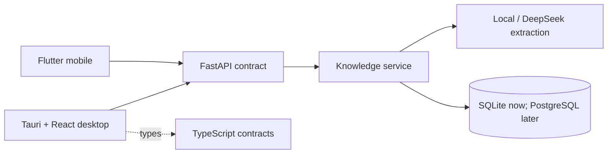

# Repository structure

## Dependency direction

Dependencies point inward. A client may depend on the HTTP contract, but the backend never imports client code. Routes delegate to services; services own workflows; persistence and model providers sit behind boundaries.

## Component ownership

- `apps/backend/gunther/api.py` owns HTTP transport only.
- `apps/backend/gunther/service.py` owns knowledge lifecycle rules.
- `apps/backend/gunther/web_capture.py` owns public-Web URL policy, pinned-IP fetching, capture limits, immutable snapshot preservation, and WebSnapshot provenance.
- `apps/backend/gunther/extraction.py` owns model-provider adapters.
- `apps/backend/gunther/models.py` owns persistence entities.
- `apps/desktop/src/pages/` owns page composition.
- `apps/desktop/src/components/` owns reusable desktop presentation.
- `apps/desktop/src-tauri/` owns native desktop configuration and capabilities.
- `apps/mobile/lib/features/<feature>/` owns each mobile view and view model.
- `apps/mobile/lib/data/` owns mobile API mapping and repositories.
- `apps/mobile/lib/data/services/` keeps durable Capture outbox payloads and retries, including stable `clientCaptureId` for Web Link snapshots.
- `packages/contracts/` owns TypeScript wire types until clients are generated from OpenAPI.

## Rules for new work

1. Put domain behavior in the Python service, not in a client.
2. Add provider-specific code behind an adapter in `extraction.py`.
3. Keep a mobile feature's view and view model together under that feature.
4. Promote code to `shared/` only after two features genuinely reuse it.
5. Do not commit databases, virtual environments, build products, or Tauri targets.
6. Keep generated Flutter runner code separate from maintained feature code; document any native customization.
7. Prefer generating desktop/mobile clients from the FastAPI OpenAPI document as the API grows.
